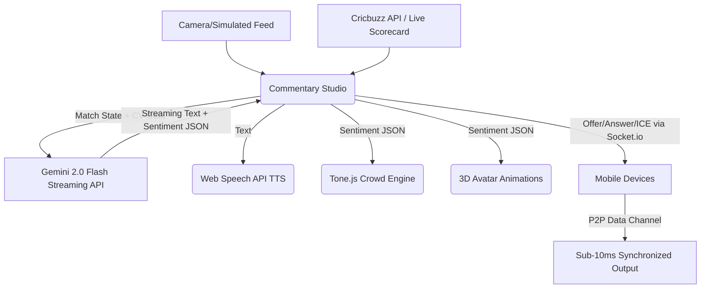

<div align="center">
  
  <h1>🏏 Commenta.AI</h1>
  <p><strong>The Future of Live Sports Broadcasting. Powered by Generative AI & WebRTC.</strong></p>
  
  <p>
    <a href="#demo">Live Demo</a> •
    <a href="#features">Features</a> •
    <a href="#architecture">Architecture</a> •
    <a href="#setup">Local Setup</a>
  </p>

  <p>
    
    
    
    
  </p>
</div>

---

## 🌟 Overview
**Commenta.AI** is a massive, production-ready full-stack platform that completely replaces traditional sports commentary. 

By ingesting real-time match data and simulated computer vision feeds, it utilizes **Google Gemini 2.0 Flash** to generate ultra-low-latency streaming commentary. This text is instantly synthesized into localized emotional audio (Web Speech API) alongside dynamic synthesized stadium crowd noise (`Tone.js`), and delivered to thousands of devices simultaneously via **P2P WebRTC data channels**.

## 🔥 Flagship Features

*   **⚡ Sub-10ms Multi-Device Sync**: We bypass traditional server bottlenecks using a custom `useWebRTC` hook that establishes peer-to-peer `RTCDataChannels` between devices via a generated QR code.
*   **🤖 3D Generative Avatars**: React Three Fiber canvases render dynamic avatars that react to the sentiment of the AI's output in real-time.
*   **🗣️ Multi-Language Personas**: Choose between Harsha (EN), Ravi (HI), Sundar (TA), and Arnab (BN). The AI drastically alters its vocabulary, bias, and TTS voice based on regional selections.
*   **⚔️ AI Battle Mode**: Two separate Gemini agents stream opposing commentary simultaneously in a split-screen 3D face-off, complete with a live audience voting meter.
*   **🏟️ Tone.js Crowd Mood Engine**: Real-time synthesized audio (Brown Noise & Filters) that reacts to the match state. Hit a six, and the filters open up to simulate a massive stadium roar.
*   **📈 Real-Time Analytics**: A comprehensive `/dashboard` utilizing `Recharts` to monitor AI sentiment distribution and WebRTC network latency across all connected peers.

## 🏗️ Architecture



## 🚀 Local Setup & Deployment

### 1. Prerequisites
*   Node.js 18+
*   Google Gemini API Key (`GEMINI_API_KEY`)

### 2. Installation
```bash
git clone https://github.com/yourusername/commenta-ai.git
cd commenta-ai
npm install
```

### 3. Environment Variables
Create a `.env` file in the root directory:
```env
GEMINI_API_KEY=your_gemini_api_key_here
```

### 4. Running Locally
Because this project utilizes both Next.js and a custom Node Socket.io server (for WebRTC signaling), you need to run both:

**Terminal 1 (Next.js Frontend):**
```bash
npm run dev
# Runs on http://localhost:3002
```

**Terminal 2 (Socket.io Backend):**
```bash
# In a real production environment, you would run your custom socket server on port 5001.
# Ensure the backend handles socket.io rooms for WebRTC ICE candidate exchange.
```

### 5. Production Deployment (Vercel)
> [!WARNING]
> **Important Architecture Note**
> Vercel Serverless Functions do **not** support persistent WebSocket connections.
> If you deploy this to Vercel, the `Next.js` application will run perfectly, but the WebRTC Signaling (`Socket.io`) will fail. 
> **Solution**: Deploy the Next.js frontend to Vercel, but host the Socket.io signaling server on a persistent container service like Render, Railway, or DigitalOcean.

## 📱 Progressive Web App (PWA)
Commenta.AI is fully configured as a PWA. Navigate to the app on iOS or Android and select "Add to Home Screen" for a full-screen, immersive mobile broadcasting experience.

---
*Built with ❤️ and ☕ for the GDG Productathon.*
